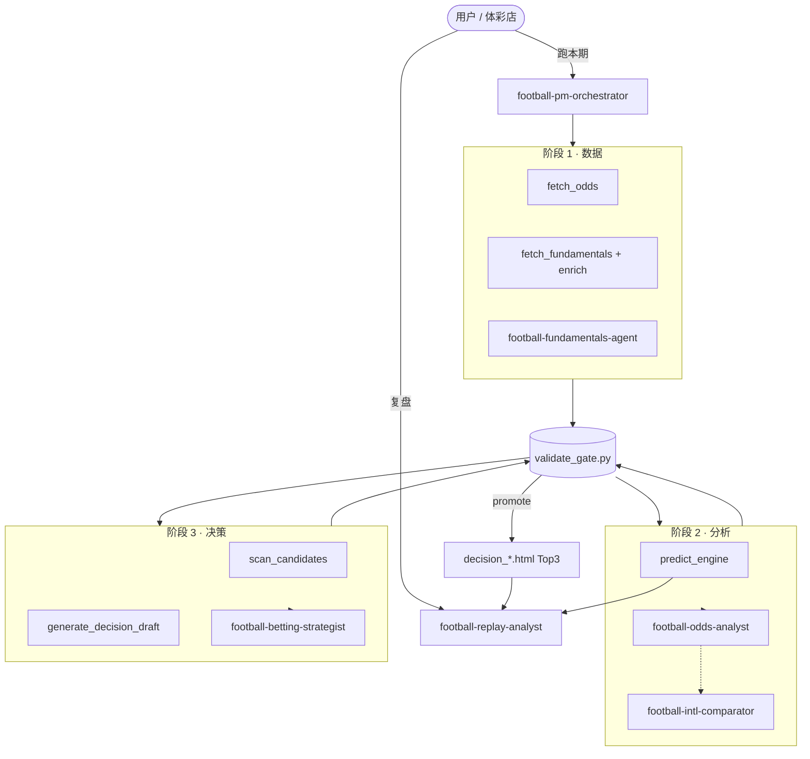

# 【产品】Agent 工作流总览

| 字段 | 值 |
|---|---|
| **版本** | v1.1 |
| **状态** | 与 PRD v1.6.0 对齐 |
| **维护者** | 产品 + Agent skill 维护者 |
| **关联文档** | `docs/prd.md` · `docs/【技术】玩法扫描与6进1漏斗v1.md` · `AGENT_ROADMAP.md` · `docs/【技术】PM编排工作流v1.md` · `docs/【技术】数据验证门禁v1.md` · `docs/【技术】复盘Agent v1.md` |

---

## 一、业务定位

### 1.1 系统目标

体彩足球赛事预测 AI 系统通过 **Agent 协作 + 脚本自动化**，完成两条闭环：

| 链路 | 目标 | 成功态 |
|---|---|---|
| **预测层** | 输出 3–5 套赛果组合（胜平负 / 总进球 / 比分） | `prediction_*.json` 与 odds 场次锚定一致 |
| **下注层** | 全玩法扫描 → Top6 → **Top3 供选** + **单关组合单**（防御/进攻自动择优） | 用户见主推 B1–B4 + 备选方案 + A/B/C 三卡 |
| **复盘层** | 赛后核对盈亏、评事前方案质量、沉淀 **投注方案改进建议**（非工程改造） | `replay/replay_report_*` + `improvements_backlog.md` |

> **业务边界**：竞彩全市场长期负 EV。Agent 是 **资金效率优化器**，不是胜率提升器；目标是 **期望亏损最少**，不承诺盈利。

### 1.2 核心原则

1. **PM 编排是第一入口**——「跑本期」默认走四阶段工作流，不跳过数据采集与分析。
2. **每阶段过数据验证门禁**——FAIL 时不 promote 正式报告，产物隔离在 `validation/`。
3. **复盘 Agent 独立**——赛后评分不挂 PM 流水线；其「改进」指 **下一期怎么选注、怎么配仓**，不是改代码 / skill / 门禁。
4. **文档对账**——改工作流 / 门禁 / skill 后，PM 阶段 4 同步 PRD 与技术 doc。

---

## 二、Agent 清单

### 2.1 总览表

| Agent | Skill 路径 | 编排关系 | 核心职责 | 主要产物 |
|---|---|---|---|---|
| **PM 编排 Agent** | `.cursor/skills/football-pm-orchestrator/` | **总控** | 四阶段调度、门禁把关、Top3 + 组合单规则、文档对账 | `validation/workflow/*_state.json` |
| **基本面 Agent** | `.cursor/skills/football-fundamentals-agent/` | PM 阶段 1 | ESPN 基本面 + 8.7 预估赛果 enrich | `fundamentals_*.{json,md}` |
| **盘口分析 Agent** | `.cursor/skills/football-odds-analyst/` | PM 阶段 2（推荐） | 去水概率、跨市场叙事、三档情境 | `analysis_*_v2.md` |
| **国际盘对照 Agent** | `.cursor/skills/football-intl-comparator/` | 可选（阶段 2） | 体彩 vs OddsPortal 双源概率 | `compare_intl_*.html` |
| **投注策略 Agent** | `.cursor/skills/football-betting-strategist/` | PM 阶段 3 | EV 闸 + **双方案组合单** + 金额分配 → Top3 + 行动卡 | `report_*.html` · `decision_*.md` |
| **复盘 Agent** | `.cursor/skills/football-replay-analyst/` | **独立** | L1 记账 + L2 评 **预测/决策方案** + **方案级改进建议** | `replay/replay_report_*` · `improvements_backlog.md` |
| **第三方数据 skill** | `openclaw-skills-football-data/` | 可选备用 | 俱乐部赛事 xG / 伤停（未默认启用） | — |

### 2.2 角色边界（谁做什么、不做什么）

| Agent | ✅ 负责 | ❌ 不做 |
|---|---|---|
| **PM 编排** | 决定阶段、调度脚本与子 Agent、汇总 Top3 | 写 V2 长文、改 yaml、跳过门禁 |
| **基本面** | 抓取 + enrich 预估赛果（8.7 节） | 手写概率、单独产出 analysis 文件 |
| **盘口分析** | 市场画像、去水概率、相关性标注 | 决定金额、抓数据、替用户下单 |
| **国际盘对照** | 双源偏差表、外部校准 | 自动决策投注、替代 V2 报告 |
| **投注策略** | 可执行注单（**单关组合**或单注参考）、合法空单、HTML 决策卡 | 写市场分析、跳过 24h 可投注池、推串关 |
| **复盘** | 赛果核对、盈亏、评预测/决策方案、写 **方案改进 backlog**（选注/仓位/玩法结构） | 赛前决策、直接改 yaml、改代码/skill/门禁/PRD |

### 2.3 与通用 PM 的区别

| | `football-pm-orchestrator` | `project-pm` |
|---|---|---|
| 范围 | 体彩足球一期报告专用 | 通用 Scrum / 蓝皮书 |
| 触发 | 「跑本期 260617」「工作流」 | 跨项目 backlog / 迭代 |
| 关系 | **足球报告走本 skill** | 不替代足球编排 |

---

## 三、赛前工作流（PM 四阶段）

### 3.1 流程总图

```
用户：「跑本期 260617」
        │
        ▼
┌─────────────────────────────────────────────────────────────┐
│  football-pm-orchestrator（PM 编排 Agent）                    │
└───────────────────────────┬─────────────────────────────────┘
                            │
    ┌───────────────────────┼───────────────────────┐
    ▼                       ▼                       ▼
 阶段 1                  阶段 2                  阶段 3
 数据采集                胜率分析                投注决策
    │                       │                       │
    ├─ fetch_odds           ├─ predict_engine       ├─ scan_candidates
    ├─ fetch_fundamentals   ├─ odds-analyst (V2)    ├─ generate_decision_draft
    │   (+ 8.7 enrich)      ├─ intl-comparator (可选)├─ betting-strategist 润色
    └─ validate_gate        └─ validate_gate        └─ validate_gate → promote
                            │
                            ▼
                    阶段 4（推荐 · 不阻塞交付）
                    PRD + 【技术】*.md 文档对账
                            │
                            ▼
              reports/report_*.html（预测 + 决策合并）
```

### 3.2 阶段明细

#### 阶段 1 · 数据采集

| 项 | 内容 |
|---|---|
| **调度** | `fetch_odds.py` → `fetch_fundamentals.py`（含 `enrich_fundamentals_forecast`） |
| **Agent** | `football-fundamentals-agent`（脚本内嵌 enrich，skill 定义标准） |
| **产物** | `snapshots/odds/*` · `snapshots/fundamentals/*`（含 **8.7 预估赛果**） |
| **门禁** | 输入存在性 + matches 非空 + forecast_enriched |
| **FAIL** | 不进入阶段 2；查 `validation/runs/*/checks.json` |

**CLI**：

```bash
cd /Users/CursorProject/football
python3 run_workflow.py --day 260617 --phase 1
```

#### 阶段 2 · 胜率分析

| 项 | 内容 |
|---|---|
| **脚本** | `predict_engine.py` → `snapshots/prediction/prediction_*.json`（默认不写独立 HTML） |
| **Agent** | `football-odds-analyst`（V2 报告，推荐）；`football-intl-comparator`（可选） |
| **门禁** | 预测 JSON 与 odds 实体锚定一致 |
| **FAIL** | 不进入阶段 3 |

**CLI**：

```bash
python3 run_workflow.py --day 260617 --phase 2
```

#### 阶段 3 · 投注决策

| 项 | 内容 |
|---|---|
| **脚本** | `scan_candidates.py` → `portfolio_lib.py` → `generate_decision_draft.py` |
| **Agent** | `football-betting-strategist` 润色草案、核对 EV 闸与金额 |
| **产物** | `validation/drafts/scan_*` · `decision_*.json` 草案 → promote 后 **`reports/report_*.html`** + `reports/decision_*.md` |
| **主推规则（T-5-9）** | 底层 EV 筛单关 → 生成 **防御型（3–4 注覆盖）** 与 **进攻型（1–2 注重注）** → **系统自动择优** → 另一套作备选 |
| **Top3 规则（T-5-7）** | Top6 池内按「参考注额 × 赔率」毛奖金降序取前 3 → 方案 A/B/C |
| **非串关** | 组合单 = 多笔独立单关；同场互斥；**不是** 2 串 1 |
| **预算** | 默认满预算 200（IMP-006 catastrophic 缩量已驳回，见 `STRATEGY_DEFAULT.yaml`） |
| **门禁** | 八类必检；`--promote` 后才算正式交付 |

**CLI**：

```bash
python3 run_workflow.py --day 260617 --phase 3 --budget 200 --promote
# 或一键全流程
python3 run_workflow.py --day 260617 --budget 200 --promote
./scripts/prefetch.sh workflow 260617 200 --promote
```

#### 阶段 4 · 文档对账（推荐）

| 项 | 内容 |
|---|---|
| **触发** | promote 后；改 `football/*.py` / 门禁 / skill；用户说「对齐 PRD」 |
| **执行** | 更新 `prd.md` 变更日志 + 相关 `【技术】*.md` + skill 步骤 |
| **清单** | `.cursor/rules/football-prd-doc-parity.mdc` |
| **阻塞** | 不阻塞当期交付，但须在下次迭代前补齐 |

### 3.3 数据验证门禁（横切各阶段）

```
输入快照 manifest
  odds_*.json · fundamentals_*.json · prediction_*.json · STRATEGY_DEFAULT.yaml
        │
        ▼
  validate_gate.py
        │
   ┌────┴────┐
 PASS      FAIL → 仅写 validation/runs/<run_id>/（不覆盖根目录正式产物）
   │
   ▼
  --promote → 根目录 decision_* / prediction_* + validation_run_id 留痕
```

| 检查类别 | 防什么 |
|---|---|
| 实体锚定 | 虚构比赛 / 张冠李戴 |
| 赔率锚定 | 编造赔率 |
| 概率 / EV 可复算 | 决策排序幻觉 |
| 决策自洽 | Top6#1 = hero-pick；空单逻辑 |
| 文案-数据一致 | Agent 叙述与 JSON 偏离 |

详见：`docs/【技术】数据验证门禁v1.md`

---

## 四、赛后工作流（独立复盘）

复盘 **不经过** PM 编排，与赛前流水线并行存在。

### 4.1 定位：方案改进，不是工程改进

| | 复盘 Agent 负责 ✅ | 不属于复盘 Agent ❌ |
|---|---|---|
| **改进对象** | 下一期 **怎么下注**：选哪类玩法、是否叠防冷、仓位是否缩量、Top3 是否该换主推 | 改 Python 脚本、skill 步骤、门禁规则、PRD、HTML 模板 |
| **典型建议** | 「碾压盘禁止叠防冷注」「主胜 <1.20 时稳档封顶」「组合单偏防御/进攻」 | 「给 validate_gate 加检查项」「重构 scan_candidates」 |
| **落地方式** | 写入 `improvements_backlog.md` → **人类审批** → 用户下一期自行调整下注或再议是否改 `STRATEGY_DEFAULT.yaml` | PM 阶段 4 文档对账、工程迭代、skill 维护 |

> **一句话**：复盘 Agent 回答「这期方案哪里选错了、下一期该怎么买更好」；**不**回答「代码该怎么改」。

### 4.2 流程

```
赛后 FT / 用户说「复盘 260616」
        │
        ▼
football-replay-analyst
        │
        ├─ 步骤 0：定位 decision_* + prediction_*
        ├─ 步骤 1：拉取/确认赛果（ESPN 或用户给分）
        ├─ 步骤 2：L1 replay_decision.py（盈亏、tracking、虚拟跟踪）
        └─ 步骤 3：L2 评预测方案 + 决策方案 + 方案改进 backlog
        │
        ▼
replay/replay_report_<issue>.md          ← 双 Agent 评分 + 归因
replay/improvements_backlog.md           ← 投注方案改进建议（待人类批「采纳/驳回/延后」）
```

| 层级 | 模块 | 产物 |
|---|---|---|
| L1 | `replay_decision.py` | `tracking.md` · decision 赛后态 · `replay/runs/*.json` |
| L2 | `football-replay-analyst` | 评分报告 + **方案级** backlog（禁止直接改 yaml / 代码） |

**L2 评分对象**（均为 **业务方案**，非软件模块）：

| 被评对象 | 评什么 |
|---|---|
| **预测引擎** | 胜负平方向、比分/总进球路径、概率校准是否靠谱 |
| **决策 Agent（策略师）** | 主推组合是否对、单关金额分配是否合理、是否应偏防御/进攻 |

**改进建议三档**（见 skill）：「本期可试」·「需满 10 期再议」·「明确不做」——均指 **下注行为/策略偏好**，样本 <10 期禁止因单期翻盘建议改 EV 闸或换骨架。

**入口话术**：「复盘 260616」· `@football-replay-analyst` · loop 赛后 FT 事件

**与 F 档 review 区别**：`decision_*_review_*` 是 **赛前只读预览**，不是复盘 Agent 输出。

详见：`docs/【技术】复盘Agent v1.md` · `replay/README.md` · `replay/improvements_backlog.md`（示例均为方案级建议）

---

## 五、Agent 协作关系图



---

## 六、对话入口速查

| 用户说 | 应调用的 Agent / 命令 |
|---|---|
| 「跑本期 260617」 | `football-pm-orchestrator` → `run_workflow.py --promote` |
| 「只抓数据」 | PM 阶段 1 |
| 「出 V2 / 盘口分析」 | `football-odds-analyst` |
| 「国际盘对照」 | `football-intl-comparator` |
| 「出策略 / Top3 / 投注单 / 组合单」 | PM 阶段 3 + `football-betting-strategist` |
| 「基本面 / 8.7 预估」 | `football-fundamentals-agent` |
| 「复盘 260616」 | `football-replay-analyst`（独立） |
| 「对齐 PRD / 文档对账」 | PM 阶段 4 |
| 「工作流卡在哪」 | `validation/workflow/<code>_state.json` |

---

## 七、正式产物 vs 验证产物

| 类型 | 目录 / 命名 | 谁可读 | 发布条件 |
|---|---|---|---|
| **正式** | `reports/report_*.html` · `reports/decision_*.md` · `snapshots/prediction/*.json` | 用户 / 体彩店 | 门禁 PASS + promote |
| **台账（本地）** | `tracking.md` | 仅本机 | 含投注金额与盈亏，**不入 Git** |
| **验证 / 草案** | `validation/runs/` · `validation/drafts/` | 工程 / Agent | 随时；FAIL 时仅此处 |
| **复盘** | `replay/replay_report_*` · `improvements_backlog.md` | 复盘者 / 下注决策者 | 赛后 L1+L2 完成；backlog 为方案建议非工程任务 |
| **中间分析** | `analysis_*_v2.md` · `compare_intl_*.html` | Agent / 深度读者 | 无强制 promote |

**禁止**：门禁 FAIL 仍写根目录正式报告；把 `validation/drafts/` 当交付不 promote。

---

## 八、默认策略与能力边界

摘自 `AGENT_ROADMAP.md`（维护者必读）：

| 配置 | 当前默认 |
|---|---|
| 策略骨架 | A（200 元预算场景） |
| `require_fundamentals` | false |
| `auto_invoke_analyst` | true |
| EV 切割 | `reject_below: -0.20` |

| Agent 能 ✅ | Agent 不能 ❌ |
|---|---|
| 去水概率、EV 闸、相关性聚合 | 估计真实概率（依赖市场） |
| 资金分配（A–E 五骨架） | 基本面战术建模、xG/ML 自训 |
| Top3 赢利方案 + HTML 决策卡 | 承诺盈利、实时盘口告警 |

---

## 九、Skill 文件索引

```
.cursor/skills/
├── football-pm-orchestrator/SKILL.md      # PM 四阶段编排
├── football-fundamentals-agent/SKILL.md   # 基本面 + 8.7 预估
├── football-odds-analyst/SKILL.md         # V2 盘口分析
├── football-intl-comparator/SKILL.md      # 国际盘对照
├── football-betting-strategist/SKILL.md   # 投注决策 + HTML
│   ├── STRATEGY_DEFAULT.yaml
│   ├── DECISION_HTML_TEMPLATE.html
│   └── PLAYBOOK.md
└── football-replay-analyst/SKILL.md       # 赛后复盘（独立）

football/
├── run_workflow.py                        # PM 一键 CLI
├── workflow_lib.py                        # 三阶段共享逻辑
├── validate_gate.py                       # 数据验证门禁
├── AGENT_ROADMAP.md                       # 演进路线与决策日志
└── docs/
    ├── prd.md                             # 权威需求
    ├── 【产品】Agent工作流总览.md          # 本文档
    └── 【技术】*.md                       # 各模块技术摘要
```

---

## 十、变更日志

| 日期 | 变更 |
|---|---|
| 2026-06-18 | 初版：汇总 7 个 Agent、PM 四阶段 + 独立复盘、门禁与产物分层 |
| 2026-06-18 | 澄清复盘 Agent：改进对象为 **投注方案/选注策略**，非软件工程 |
